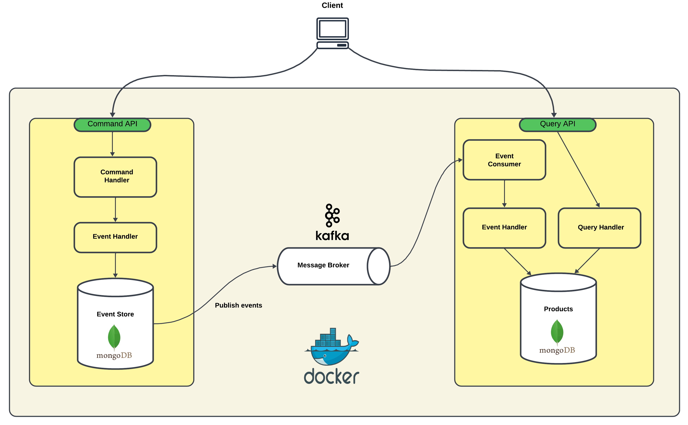
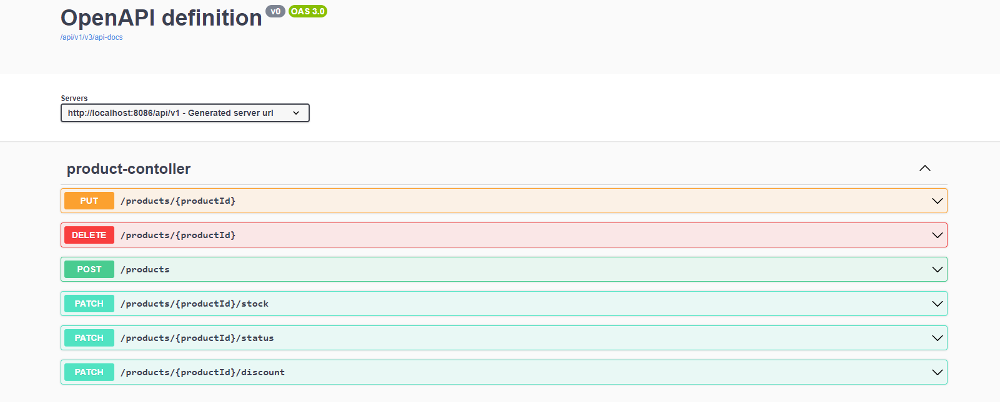
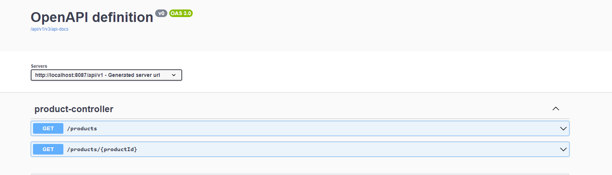

# CQRS and Event Sourcing Example With Spring Boot


### About the Project 
- The main purpose of the project is demonstrating how to use <b>CQRS</b>(Command Query Responsibility Segregation) and <b>Event Sourcing</b> architectural patterns on microservices which are designed for managing the lifecycle of product-related information.
- During the implementation of project, following technologies have been used:
  * Java 17
  * Spring Boot
  * MongoDB
  * Apache Kafka
  * Zookeeper
  * Swagger UI
  * Maven
  * Docker
- The command microservice plays a pivotal role in handling a set of commands tailored to the intricacies of product management. These commands:
  * ProductAddedCommand
  * ProductDeletedCommand
  * ProductUpdatedCommand
  * ProductStockChangedCommand
  * ProductDiscountedCommand
  * ProductStatusChangedCommand
- On the other hand the query microservice focuses on efficiently retrieving and presenting product-related information. The query microservice is designed to handle various queries, enabling clients to seamlessly  access the data they need. These queries can be accessed from the <b>"REST API Endpoints"</b> section below.

### How to run Project ? 

  1. Firstly, you should have Docker in your computer. If you don’t have Docker, please install it.
  2. Clone project
  3. Open project and go to <b>product.command</b> folder.
  4. Run `docker build -t product-command-app . `
  5. Go to <b>product.query</b> folder.
  6. Run `docker build -t product-query-app . `
  7. Go to <b>cqrs-and-event-sourcing-example</b> folder.
  8. Run `docker-compose up`. The project will run in about 2 minutes.

### Rest API Endpoints
#### Here is the active REST API endpoints of command microservice:
  ##### <a> Create a product
```
   http://localhost:8086/api/v1/products POST
   {
      "name": "Computer",
      "description": "Description",
      "status": "AVAILABLE",
      "numberInStock": 100,
      "price": 4500
   } 
```

##### <a> Update a product
```
   http://localhost:8086/api/v1/products/{productId} PUT
   {
      "name": "Phone",
      "description": "Description",
      "status": "AVAILABLE",
      "numberInStock": 20,
      "discountRatio": 50
      "price": 6000
   }
```

##### <a> Delete a product
```
   http://localhost:8086/api/v1/products/{productId} DELETE
```

##### <a> Update stock of product
```
   http://localhost:8086/api/v1/products/{productId}/stock PATCH
```

##### <a> Update status of product
```
   http://localhost:8086/api/v1/products/{productId}/status PATCH
```

##### <a> Update discount of product
```
   http://localhost:8086/api/v1/products/{productId}/discount PATCH
```
  * The listed endpoints can be accessed and triggered on Swagger UI.
  * Open `http://localhost:8086/api/v1/swagger-ui/index.html` in your browser.
  
  
#### Here is the active REST API endpoints of query microservice:
##### <a> Get all products
```
   http://localhost:8087/api/v1/products GET
```
##### <a> Filter products by price 
```
   http://localhost:8087/api/v1/products?minPrice=2000&maxPrice=17000 GET
```
##### <a> Get product by id
```
   http://localhost:8087/api/v1/products/{productId} GET
```
##### <a> Get products which have been created specific time period 
```
   http://localhost:8087/api/v1/products?startDate=2022-06-09&endDate=2022-10-10 GET
```
##### <a> Filter products by name
```
   http://localhost:8087/api/v1/products?name=computer GET
```
##### <a> Filter products by status
```
   http://localhost:8087/api/v1/products?status=AVAILABLE GET
```
* The listed endpoints can be accessed and triggered on Swagger UI.
* Open `http://localhost:8087/api/v1/swagger-ui/index.html` in your browser.
* <b>Little Reminder:</b> As seen at below screenshot, it seems like that query microservice just has 2 active REST endpoint. However, it has 6 endpoints.
  Swagger UI merges the same REST endpoint which has different query parameters.
 


### How to check databases ?
```
    -> docker exec -it product-command-db bash
    -> mongosh
    -> use product_command_management
    -> db.eventStore.find({})
```

```
    -> docker exec -it product-query-db bash
    -> mongosh
    -> use product_query_management
    -> db.products.find({})
```
